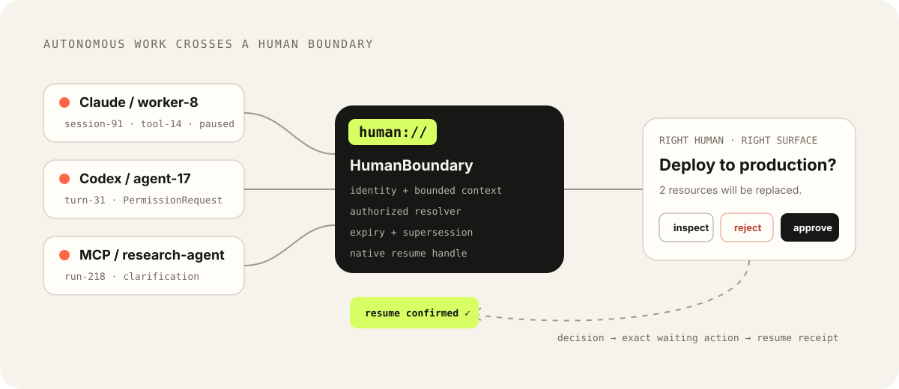
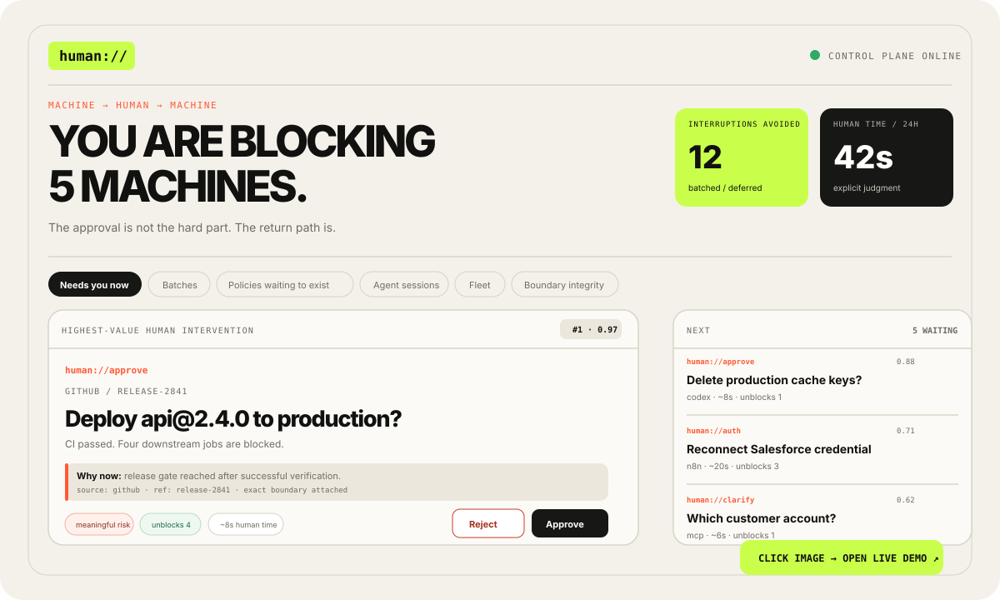

<div align="center">

# `human://` Boundary Lab

### A human decision has one destination: the exact waiting task.

**See the boundary. Make a decision. Try to replay it. Verify what happened.**

[**Original interactive experience ↗**](https://hippoley.github.io/PAJ-Eval/human/) · [**Run the new Lab ↓**](#run-the-lab) · [**Test the contract ↓**](#boundary-contract) · [**Source and eligibility ↓**](#source-and-eligibility)


</div>


<p align="center"></p>

<p align="center"></p>

> **Asset provenance:** the three SVG files in `docs/assets/` are copied without redesign from the pre-existing [hippoley/HumanQueue](https://github.com/hippoley/HumanQueue/tree/main/docs/assets) project. They are not new contest-period artwork.

---

## The product, not just the screen

An autonomous task reaches a human boundary. The human approves or rejects that **specific task**, and replaying a resolved decision must not trigger a second simulated execution.

```text
Task A ─── waiting ─── approve ──→ simulated_completed
                                  ↳ replay → 409, no second outcome
Task B ─── waiting ───────────────────────────→ still waiting
                                  ↳ reject → rejected
```

**The screen is not the proof. The return-path invariant is.**

## See the interfaces

| Surface | What it is | Entry point |
| --- | --- | --- |
| **Original human:// experience** | Exact source-level copy of the pre-existing PAJ-Eval browser demo. All of its original client-side simulations, tabs and navigation remain; **it is not a live Gateway**. | `/` |
| **Boundary Lab (new implementation)** | Independent Node.js-backed simulation: create requests, approve/reject the exact ID, test a duplicate decision, inspect audit events. | `/lab` |
| **Conformance runner** | Executable machine-readable verification of five limited boundary invariants. | `node conformance/run.mjs` |

The original interface is viewable now: **[Open the existing human:// live experience ↗](https://hippoley.github.io/PAJ-Eval/human/)**. A separate hosted URL for this repository has **not yet been verified**; run locally for the two-entry experience.

## Run the Lab

Node.js 18 or newer; no API keys or npm dependencies.

```bash
git clone https://github.com/hippoley/humanqueue-boundary-lab.git
cd humanqueue-boundary-lab
npm test
node conformance/run.mjs
npm start
```

Visit **http://localhost:3000/** to see the exact original browser presentation or **http://localhost:3000/lab** to exercise the new server-backed Lab.

### A reproducible 60-second test

1. In `/lab`, click **Create demo A + B**.
2. Approve A; confirm B remains pending.
3. On A, click **Replay approval (test guard)**; the API returns 409 with no extra audit outcome.
4. Reject B; inspect the event timeline.
5. For automated evidence, run `npm test` and `node conformance/run.mjs`.

## Boundary contract

| Invariant | Evidence |
| --- | --- |
| Task IDs are distinct | `test/core.test.js`, `conformance/run.mjs` |
| Approval changes only the targeted task | `test/http.test.js` |
| Replay cannot add a second simulated outcome | `test/http.test.js`, `conformance/run.mjs` |
| Invalid decisions fail closed | `test/core.test.js`, `conformance/run.mjs` |
| Audit events remain linked to the request | `test/http.test.js` |

See [Boundary Invariants](docs/BOUNDARY-INVARIANTS.md), [Conformance Runner](conformance/README.md), and [real HumanQueue Gateway interoperability assessment](interop/HUMANQUEUE-GATEWAY.md) (source review only; no live cross-runtime test yet). These checks cover the in-memory reference only: **crash recovery, genuine agent resume, authentication and real-world exactly-once execution are not proven**.

## A critical distinction: this is NOT the complete HumanQueue runtime

The mature [**HumanQueue / human:// project**](https://github.com/hippoley/HumanQueue) contains a Python Gateway, FastAPI, SQLite persistence, CLI, native Agent adapters, channel integrations, lifecycle/recovery mechanisms and substantially broader tests.

This repository is **not** a port or full reproduction of those runtime capabilities. Its `/` page is a verbatim copy of the earlier **PAJ-Eval** demo page; its `/lab` implementation is a narrower, separately written educational simulation. A browser-identical copy is not functionally equivalent to the production-oriented service.

For the actual full system, use [**hippoley/HumanQueue**](https://github.com/hippoley/HumanQueue) and its documented `humanq demo` workflow rather than treating this Lab as a replacement.

## Source and eligibility

- **Pre-existing UI reused with attribution:** `src/index.html` copies [`hippoley/PAJ-Eval/docs/human/index.html`](https://github.com/hippoley/PAJ-Eval/blob/main/docs/human/index.html) verbatim at the entrant's request. **Do not submit it as newly developed work.**
- **New Lab implementation:** `src/lab.html`, `src/core.js`, `src/server.js`, `test/`, and `conformance/`, created separately for Boundary Lab.
- **Devpost Learn Skill Pack:** The planning files under `devpost/` are currently assistant-prepared **drafts**. They do not prove that the official learner-led Skill Pack was executed. See [process status](devpost/PROCESS_STATUS.md). Do not make a completion or eligibility declaration until the actual process is finished and the entrant confirms it.
- **Security:** Educational simulation only. In-memory state is lost on restart. Do not expose its unauthenticated API as a production approval service.

## Repository map

```text
src/index.html           Pre-existing PAJ-Eval human:// UI copy (browser simulation)
src/lab.html             New Boundary Lab interaction
src/server.js            Node HTTP API, serves both pages
src/core.js              Exact-task decision state engine
test/                    Core and HTTP regression tests
conformance/             Independent-machine-readable test harness
devpost/                 Planning drafts and process record
docs/BOUNDARY-INVARIANTS.md
```

Apache-2.0 · [LICENSE](LICENSE)
